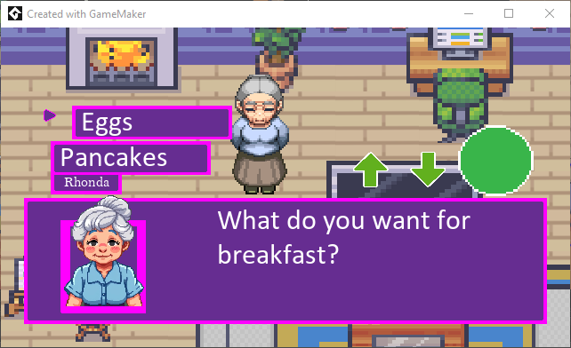

# Cyber City

**Project members:**  
- Jennifer Telisczak  
- Brandon Dang  
- Boo Park  
- Dante Terminella

**Date:**  
November 16, 2024

**Course:**  
2024, Fall, CYBER W295, Section 2 (Wednesday)

# A big "THANK YOU" to the **Center for Long-Term Cybersecurity (CLTC)** for your support.

---

## Teaser:  
A mobile RPG to teach seniors and non-tech users about social engineering and cybersecurity threats in an engaging, interactive way.

---

## Description:

**Cyber City** is a mobile role-playing game designed to educate users, especially seniors and non-technical individuals, about the dangers of social engineering and cybersecurity threats.

In today’s digital world, cybercriminals frequently target unsuspecting individuals, with social engineering scams being among the most common and devastating. Too often, people learn these lessons the hard way—either by falling victim themselves or witnessing others do so.

To address this growing problem, our project uses gamification and role-playing scenarios to immerse players in real-world cybersecurity challenges. Through interactive gameplay, players will experience firsthand how social engineering scams unfold, helping them recognize the warning signs and take proactive steps to protect themselves before it's too late.

# How to Open in GameMaker
1. Clone repository to a local folder
2. Launch GameMaker
3. In the dashboard, choose "Open"
4. Browse to your newly cloned folder
5. Select *CyberCity.yyp*

The project is in GML Code. Here's a link for more information https://manual.gamemaker.io/monthly/en/GameMaker_Language/GML_Overview/GML_Overview.htm

# Tutorials
* https://gamemaker.io/en/tutorials
* This one seems like a good one to learn aobut how to start from scratch. Part 1 of 3 https://www.youtube.com/watch?v=pU26LtyzM8k
  
# Assets
Resources
* https://game-icons.net/
* https://gamemaker.io/en/bundles
* http://opengameart.org/
* http://www.pixelprospector.com/graphics

Sound Effects
* http://freesound.org/
* http://www.gamemasteraudio.com/

Music Resources
* https://jamendo.com/
* https://magnatune.com/
* https://ourmusicbox.com/
* http://www.pixelprospector.com/sound-music

# Background
* https://gamemaker.io/en/blog/towers-vs-monsters-template

# Additional Links
* https://www.reddit.com/r/gamedev/wiki/faq/#wiki_getting_started
